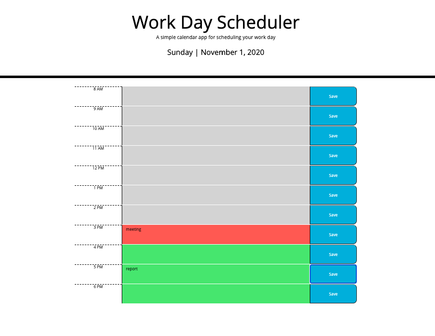

# About
A work day scheduler that displays the current day and date.  Each hour block is color coded: gray indicating past hours, red for the current hour, and green for future hours.  Each hour block is also a textarea, allowing the user to enter plans, and save those to local storage so that they persist even after refreshing the page.  

# Screenshot of the deployed site

# Link to deployed site
https://rekroetch.github.io/work_day_scheduler/
